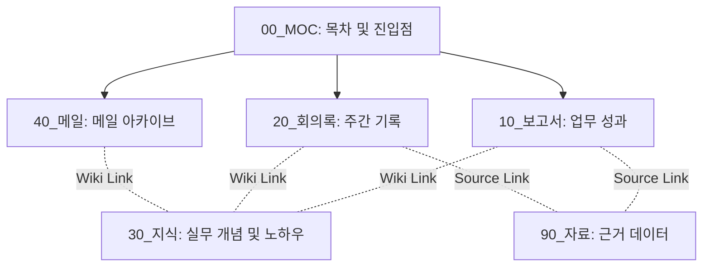

# 업무 지식창고 (General Work)

이 저장소는 옵시디언(Obsidian) 볼트 형식을 활용한 개인 및 팀의 업무 지식 관리 공간입니다. 
보고서, 회의록, 지식 원자 노트, 이메일 아카이빙 등을 구조화하여 관리하며, 각 문서 간 유기적인 연결을 지향합니다.

---

## 지식 연결 구조 (Data Flow)

이 저장소의 문서들은 목차(MOC)를 중심으로 상호 유기적인 링크 연결 구조를 가집니다. 신규 문서가 추가되면 연관된 원자 지식과 근거 자료가 위키링크를 통해 그물망 형태로 결합됩니다.

---

## 폴더 구조

보관함 내부의 파일들은 아래와 같은 기준에 따라 분류됩니다.

- **`00_MOC/`**: 주제별 목차(Map of Content) 및 진입점 노트를 모아둔 공간입니다. 각 분야별 문서들을 최신순 또는 주제별로 구조화하여 탐색을 돕습니다.
- **`10_보고서/`**: 주간 및 월간 성과 보고서, 프로젝트 기획안, 결과 분석 보고서 등을 저장합니다.
- **`20_회의록/`**: 정기 주간 회의, 프로젝트 미팅 등 모든 회의의 기록을 저장합니다.
- **`30_지식/`**: 업무 중 얻은 실무 지식, 용어 정의, 가이드라인 등 단일한 주제를 다루는 원자 노트를 저장합니다.
- **`40_메일/`**: 주고받은 업무용 이메일을 스레드 단위로 정리하고 타임라인 형태로 보관합니다.
- **`90_자료/`**: 보고서나 회의록에 등장하는 데이터의 신뢰성을 보장하기 위한 원본 데이터(Raw Data) 및 참고 자료들을 아카이빙합니다.

## 에이전트 스킬 구성

AI 어시스턴트(Claude Code 등)가 업무 프로세스를 보조할 수 있도록 개발된 스킬 스펙이 `.claude/skills/` 및 `.agents/skills/` 디렉토리에 정의되어 있습니다.

- **jira-ticket-dispatch**: 회의록이나 보고서 등의 Action Item을 분석하여 Jira 티켓을 자동 스케치하고 등록하는 스킬
- **mail-organize**: 이메일 텍스트를 분석하여 한 줄 요약, 일정, 실행사항을 정리하고 동일 스레드의 메일 노트를 누적 갱신하는 스킬
- **folder-organize**: 보관함 내의 폴더 구조를 논리적 기준(시간, 주제, 유형)에 따라 재정리하고 끊어진 위키링크를 보정하는 스킬
- **gdrive-organize**: 구글 드라이브의 특정 폴더 내 임시 파일을 읽어 적절한 분류 폴더로 분류 및 아카이빙을 돕는 스킬
- **gcal-event**: 회의록 등에서 약속된 일정을 추출해 구글 캘린더에 연동 및 등록하는 스킬

## MCP 설정 (MCP Setup)

### MCP (Model Context Protocol) 연동 요구사항
에이전트가 자동화 스킬을 통해 외부 연동 작업을 수행하려면, 실행 환경에 다음 MCP 서버들이 연동되어 있어야 합니다.
- **Google Calendar MCP**: 캘린더 일정 자동 생성 및 조회 (`gcal-event` 스킬 필수)
- **Google Drive MCP**: 구글 드라이브 파일 정리 및 이동을 위해 필요하며, 목적에 따라 **회사 계정** 또는 **개인 계정** 연동이 요구됩니다. (`gdrive-organize` 스킬 필수)
- **Jira MCP**: 실행사항 기반 티켓 스케치 및 자동 생성 (`jira-ticket-dispatch` 스킬 필수)
- **Composio MCP**: 외부 SaaS 툴체인 연동 자동화를 위해 사용되며, **회사 계정** 및 **개인 계정** 목적에 맞는 커넥터 연동이 필요합니다.
- **Chrome DevTools MCP**: 웹 기반 추가 작업 및 조작 보조

## 작성 및 관리 규칙

모든 문서는 정보의 유기적인 결합과 일관성을 위해 아래 규칙을 준수하여 작성됩니다. 상세한 내용은 `work_store/CLAUDE.md` 파일에서 정의하고 있습니다.

1. **Frontmatter(YAML) 작성**: 모든 마크다운 문서 최상단에 제목, 작성일, 태그, 관련 문서 링크(related)를 의무적으로 기재합니다.
2. **최상위 제목 일치**: 파일 이름과 문서 본문의 최상위 H1(`# 제목`) 텍스트는 항상 동일하게 유지합니다.
3. **위키링크 활용**: 연관성이 있는 다른 문서나 근거 자료는 `[[문서명]]` 형식으로 본문 내에서 연결합니다.
4. **수치 및 사실 출처**: 본문에 기술하는 모든 수치 데이터는 반드시 `90_자료/` 폴더 내 원본 노트를 링크해 출처를 밝혀야 합니다.

---

## 사용 가이드 (Workflow Guide)

이 지식창고는 에이전트와의 협업을 통해 자료 수집부터 태스크 연동까지 유기적인 업무 워크플로우를 제공합니다.

1. **원천 자료 입력**: 메일 텍스트, 메신저 요약 회의록 등을 복사하여 에이전트에게 정리를 요청합니다.
   - 예: `"이 메일 정리해서 저장해줘 [본문]"`
2. **구조화 및 스레드 병합**: 에이전트가 스킬 정의에 따라 문서를 가공하여 해당 폴더에 저장합니다. 기존에 동일한 스레드의 문서가 있다면 새 파일을 만들지 않고 기존 문서의 내용을 업데이트하고 타임라인을 누적합니다.
3. **목차(MOC) 자동 갱신**: 신규 추가되거나 변경된 문서 링크는 관련 MOC 인덱스 파일에 최신순으로 자동 갱신됩니다.
4. **외부 서비스 연동**: 문서 내부의 실행 사항이나 마감 일정을 감지하여 구글 캘린더나 Jira에 연동 등록한 뒤, 완료된 일정/티켓 링크를 원본 문서의 실행사항 항목에 업데이트합니다.
5. **지식 연결 및 정리**: 작성된 문서들은 위키링크(`[[문서명]]`)를 활용하여 지식 원자 노트 및 근거 데이터 자료들과 유기적으로 결합합니다. 자료가 과도하게 누적될 경우 폴더 정리 스킬을 호출해 디렉토리 구조를 체계화합니다.
